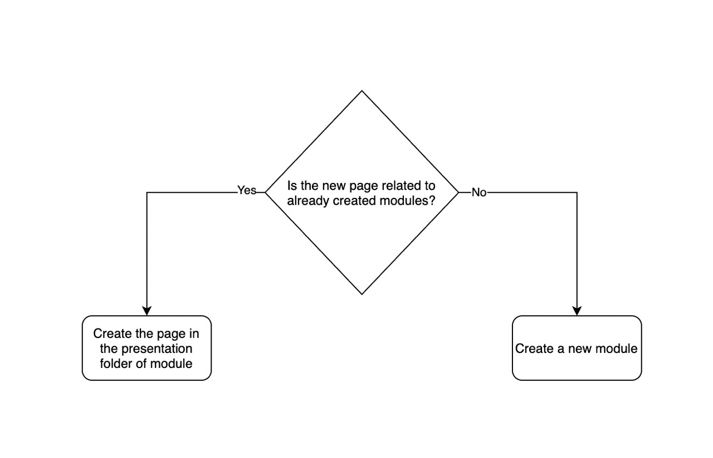
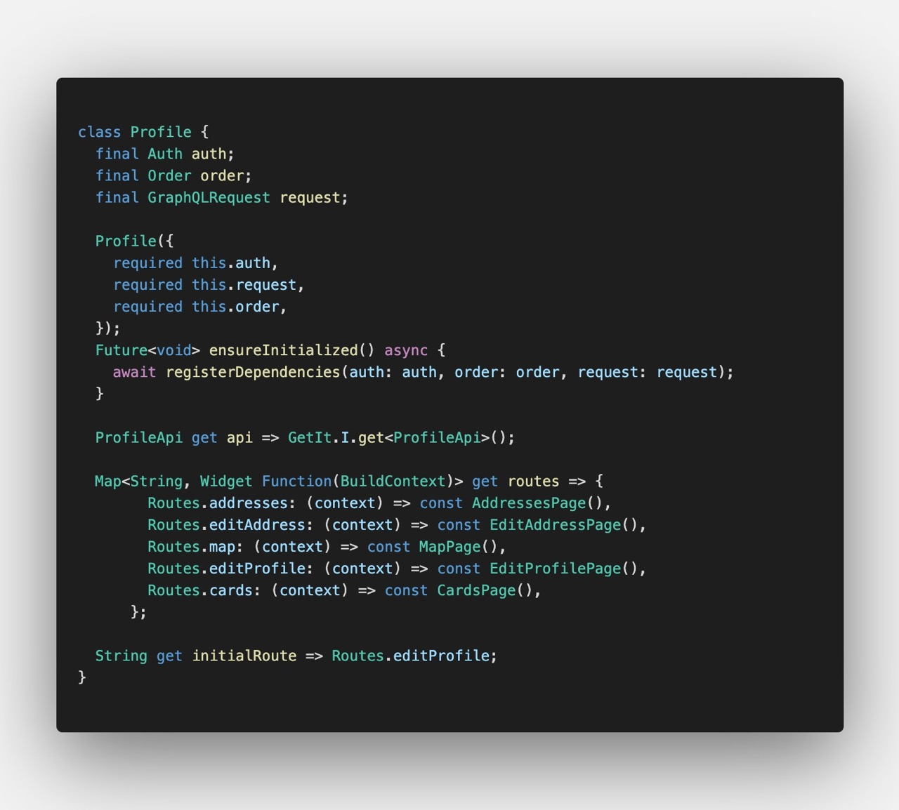
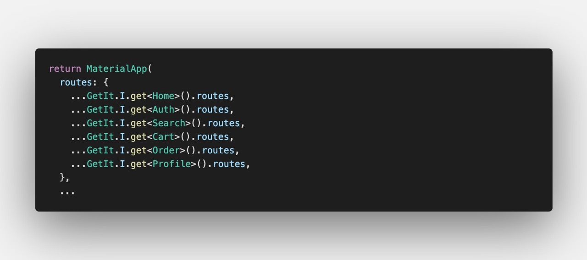

## Creating a new page

To create a new page, first of all consider if the new page should be in already defiend modules or not. If it wasn't
then goto [Creating a new module](#Creating a new module)

### 1. Create page classes

Choose the module and then head into the presentation folder of it.
Create a new folder for new page and also create the files `page.dart` and `controller.dart`.

In `page.dart` add the widget and in `controller.dart` add the statemangment codes with
any package you like to use.

All you have to do is to retreive data from application layer and pump it to the widgets.

After creating the page, You have also create a route for it. The routes of pages of a module are in
`presentation/routes.dart` file. After you created a route, You need to register the page in `MaterialApp`.

### 2. Registering page in MaterialApp

`main.dart` file of every module contains a variable called `routes` which is used to
register the routes.
You need to add the string variable of route (which you created in previous step) in this Map and then
map it to the page you just created.

All routes from all modules are gathered in the MaterialApp. It's Also the same for `onGeneratedRoutes`.

After doing these steps you are able to navigate to new page.

## Create a new module

If you are adding new features to the app and they don't blong to already created modules, Then follow these steps
to create a new module.

As we spoke earlier, Every module has the same structure. You can see [Module structure](/module-structure/) and
get familiar with it.

So basically all you need to do is create these folders and then add the classes that you need. Also
feel free to look at already created modules or copy them and change the names.

