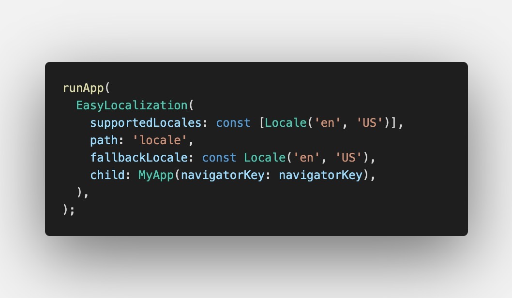

Follow these steps to add a new language

1. Create translations file in `locale/` folder. The translation file should be a JSON file and 
named as the language you are trying to add.

example
`locale/en-US.json`
`locale/en-UK.json`
`locale/de-DE.json'

2. Open `lib/main.dart` file and add the new locale to `supportedLocales` of `EasyLocalization`(line 54).

After this, The locale will be shown if the user device has the same locale.

---

### Setting as the default locale

You can add a `startLocale` in `EasyLocalization` widget in `lib/main.dart` and this locale will be the
default locale for your app.

### Setting as the fallback locale

Fallback locale is when the device locale is not supported by the app. You can add a `fallbackLocale` in
`EasyLocalization` widget in `lib/main.dart` and this locale will be used when the device locale is not
supported by the app.

